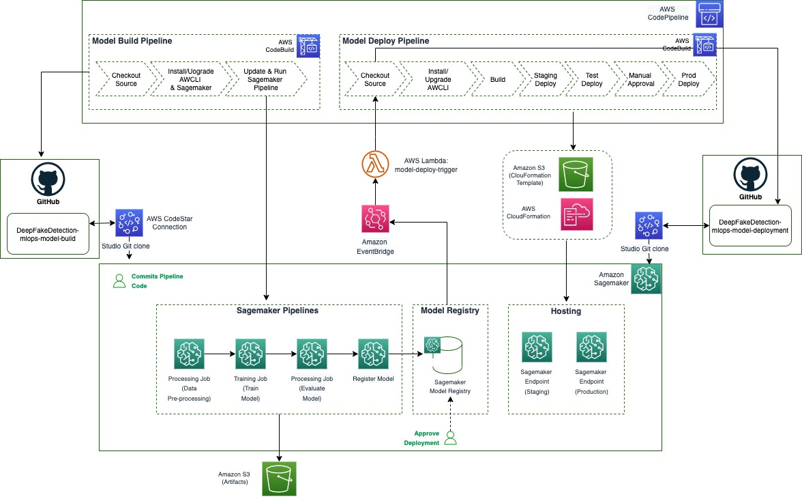
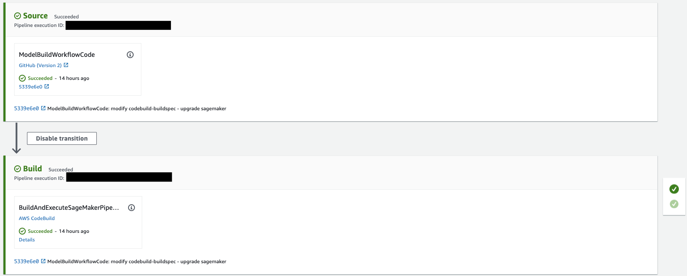
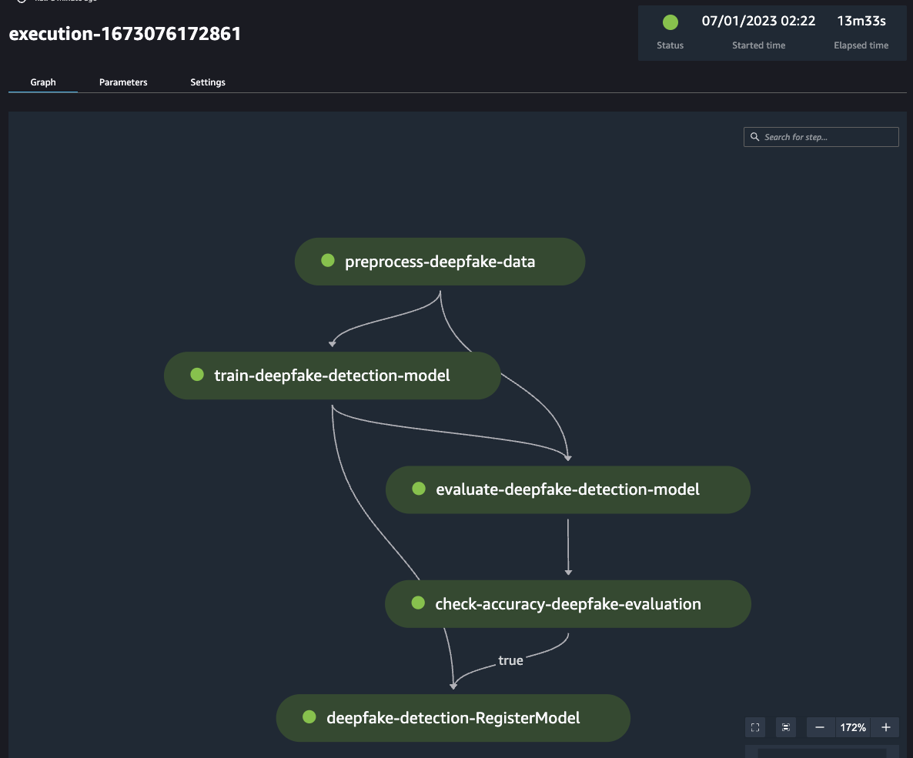
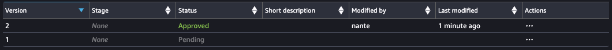

# Deepfake Detection MLOps - Build End-to-End Pipeline using Sagemaker Pipeline, AWS CodeBuild and AWS CodePipeline

This project consists of the implementation of end-to-end machine learning pipelines for [deepfake video detection](https://github.com/naram92/DeepFakeDetection), including data pre-processing, training, model deployment using different services on AWS including mainly Sagemaker Pipeline, AWS CodeCommit, AWS CodePipeline and AWS CloudFormation.

The project is created based on the [SageMaker Project Template - MLOps template for model building, training and deployment with third-party Git repositories](https://docs.aws.amazon.com/sagemaker/latest/dg/sagemaker-projects-templates-sm.html#sagemaker-projects-templates-git-code-pipeline).

### Project layout

The codebuild execution instructions. This file contains the instructions needed to kick off an execution of the SageMaker Pipeline in the CICD system (via CodePipeline). 

```
|-- codebuild-buildspec.yml
```


The pipeline artifacts, which includes a pipeline module defining the required `get_pipeline` method that returns an instance of a SageMaker pipeline, a preprocessing script and a model evaluation script to measure the accuracy of the model that's trained by the pipeline.

```
|-- pipelines
|   |-- deepfake
|   |   |-- preprocess
|   |   |   |-- blazeface.py
|   |   |   |-- face_extract.py
|   |   |   |-- preprocess_deepfake.py
|   |   |   |-- requirements.txt
|   |   |-- code
|   |   |   |-- s3dataset.py
|   |   |   |-- test_train.py
|   |   |   |-- train.py
|   |   |   |-- requirements.txt
|   |   |-- evaluate
|   |   |   |-- evaluate.py
|   |   |   |-- test_evaluate.py
|   |   |-- __init__.py
|   |   |-- pipeline.py

```

Utility modules for getting pipeline definition jsons and running pipelines:

```
|-- pipelines
|   |-- get_pipeline_definition.py
|   |-- __init__.py
|   |-- run_pipeline.py
|   |-- _utils.py
|   `-- __version__.py
```

Python package artifacts:
```
|-- setup.cfg
|-- setup.py
```

A stubbed testing module for testing the pipeline:
```
|-- tests
|   `-- test_pipelines.py
```

The `tox` testing framework configuration:
```
`-- tox.ini
```

## Overall Architecture

The overall architecture of the project is shown below:



The architecture is divided into two main parts:

* The first part involves processing data, training and testing models, and registering the models in the SageMaker Model Registry (in this github repository).
* The second part involves automating the deployment of models from the SageMaker Model Registry to SageMaker endpoints for real-time inference. When a new model version is registered and approved, it initiates a deployment automatically (in this [link](https://github.com/naram92/DeepFakeDetection-mlops-model-deployment)).

### Code Pipeline 
An AWS CodePipeline pipeline that has source and build steps. The source step points to the Github repository. The build step gets the code from that repository, creates and updates the SageMaker pipeline, starts a pipeline execution, and waits for the pipeline execution to complete.



### Model registry
Models that meet the conditions set in the condition step, in our pipeline this is the check-accuracy-deepfake-evaluation step will be registered in the model registry as shown in the following figures.





When a new model version is registered and approved, it automatically initiates a deployment using the second part of the architecture presented above (in this [link](https://github.com/naram92/DeepFakeDetection-mlops-model-deployment)).


